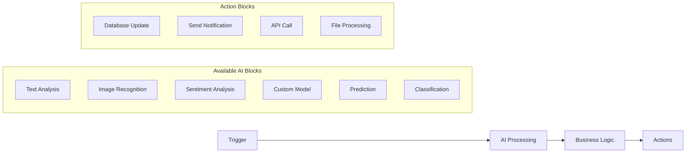
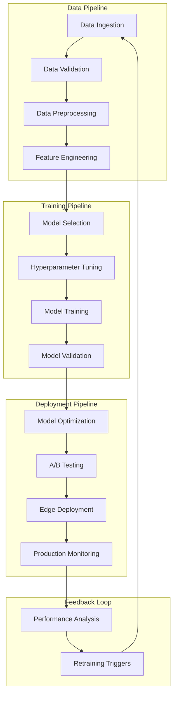
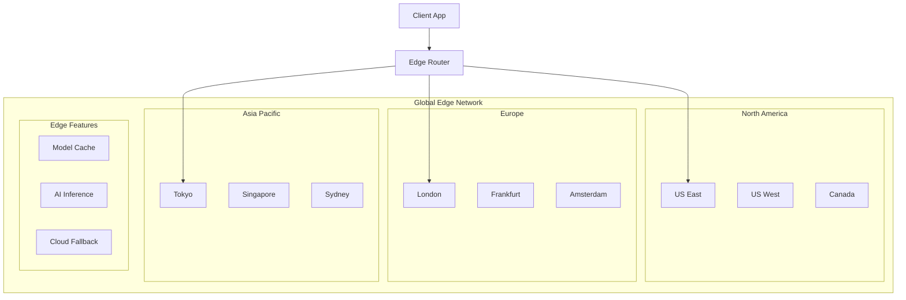
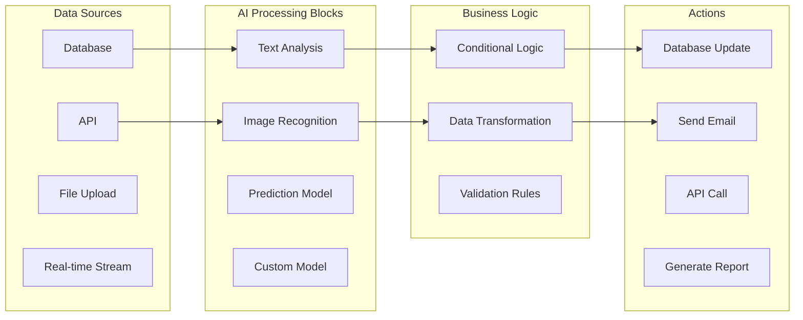

# 🔧 Advanced Features Specification: AI-Powered BaaS

## Table of Contents
- [Native AI Workflow Engine](#native-ai-workflow-engine)
- [Custom Model Training Pipeline](#custom-model-training-pipeline)
- [Intelligent Predictive Scaling](#intelligent-predictive-scaling)
- [AI-Powered Security & Compliance](#ai-powered-security--compliance)
- [Edge AI Deployment Network](#edge-ai-deployment-network)
- [No-Code AI Pipeline Builder](#no-code-ai-pipeline-builder)
- [Real-Time AI Streams](#real-time-ai-streams)
- [Multi-Model AI Ecosystem](#multi-model-ai-ecosystem)
- [Intelligent Analytics & Insights](#intelligent-analytics--insights)
- [Smart Infrastructure Management](#smart-infrastructure-management)

## Native AI Workflow Engine

### Overview
The Native AI Workflow Engine is the core differentiator that allows developers to create complex AI-powered business logic without writing AI/ML code. Unlike competitors who require external AI services, our platform has AI capabilities built into every layer.

### Key Features

#### 1. Visual Workflow Builder


#### 2. Pre-built AI Templates
```json
{
  "content_moderation": {
    "description": "Automatically moderate user-generated content",
    "triggers": ["content.created", "content.updated"],
    "ai_steps": [
      "toxicity_detection",
      "spam_classification",
      "image_safety_check"
    ],
    "actions": ["flag_content", "notify_moderators", "auto_remove"]
  },
  "smart_recommendations": {
    "description": "Generate personalized recommendations",
    "triggers": ["user.login", "item.viewed"],
    "ai_steps": [
      "user_behavior_analysis",
      "collaborative_filtering",
      "content_based_filtering"
    ],
    "actions": ["update_recommendations", "send_email", "track_metrics"]
  }
}
```

#### 3. Real-time Workflow Execution
```javascript
// Example: Smart customer service workflow
const workflow = await aibaas.workflows.create({
  name: "Smart Customer Service",
  triggers: ["support_ticket.created"],
  steps: [
    {
      type: "ai.intent_detection",
      model: "customer_intent_classifier_v3",
      inputs: ["ticket.subject", "ticket.description"]
    },
    {
      type: "ai.sentiment_analysis",
      model: "customer_sentiment_bert",
      inputs: ["ticket.description"]
    },
    {
      type: "business_logic",
      condition: "intent === 'billing' && sentiment < 0.3",
      actions: [
        "assign_to_senior_agent",
        "set_priority_high",
        "notify_manager"
      ]
    },
    {
      type: "ai.auto_response",
      model: "customer_response_gpt",
      inputs: ["intent", "sentiment", "customer_history"],
      output: "suggested_response"
    }
  ],
  real_time: true,
  sla: "30_seconds"
});
```

### Technical Implementation

#### Workflow Engine Architecture
```typescript
interface AIWorkflow {
  id: string;
  name: string;
  version: string;
  triggers: WorkflowTrigger[];
  steps: WorkflowStep[];
  metadata: WorkflowMetadata;
}

interface WorkflowStep {
  id: string;
  type: 'ai' | 'business_logic' | 'action';
  model?: string;
  inputs: string[];
  outputs: string[];
  conditions?: string[];
  timeout: number;
  retry_policy: RetryPolicy;
}

class WorkflowEngine {
  async execute(workflow: AIWorkflow, context: any): Promise<WorkflowResult> {
    const execution = new WorkflowExecution(workflow, context);
    
    for (const step of workflow.steps) {
      const result = await this.executeStep(step, execution.context);
      execution.addResult(step.id, result);
      
      if (result.shouldTerminate) break;
    }
    
    return execution.getResult();
  }
  
  private async executeStep(step: WorkflowStep, context: any): Promise<StepResult> {
    switch (step.type) {
      case 'ai':
        return await this.aiService.predict(step.model, step.inputs, context);
      case 'business_logic':
        return await this.evaluateConditions(step.conditions, context);
      case 'action':
        return await this.executeAction(step, context);
    }
  }
}
```

## Custom Model Training Pipeline

### Overview
Unlike Firebase's basic ML Kit or Supabase's vector-only approach, our platform provides a complete model training pipeline that allows developers to create custom AI models using their own data.

### Key Features

#### 1. Automated Model Training
```python
# Simple API for complex model training
training_config = {
    "model_type": "text_classifier",
    "data_source": {
        "type": "database",
        "table": "user_feedback",
        "text_column": "comment",
        "label_column": "sentiment"
    },
    "base_model": "bert-base-uncased",
    "training_params": {
        "epochs": 10,
        "batch_size": 32,
        "learning_rate": 2e-5,
        "validation_split": 0.2
    },
    "optimization": {
        "quantization": True,
        "pruning": True,
        "edge_deployment": True
    },
    "auto_deploy": {
        "enabled": True,
        "staging_first": True,
        "rollback_on_degradation": True
    }
}

training_job = await aibaas.models.train(training_config)
```

#### 2. Multi-Modal Training Support
```python
# Train models on different data types
multimodal_config = {
    "model_type": "multimodal_classifier",
    "inputs": [
        {
            "type": "text",
            "source": "product_descriptions",
            "preprocessing": "tokenization"
        },
        {
            "type": "image",
            "source": "product_images",
            "preprocessing": "resnet_features"
        },
        {
            "type": "tabular",
            "source": "product_metadata",
            "preprocessing": "standardization"
        }
    ],
    "target": "product_category",
    "fusion_strategy": "late_fusion"
}
```

#### 3. Automated Hyperparameter Optimization
```python
# AI optimizes AI models
optimization_config = {
    "strategy": "bayesian_optimization",
    "search_space": {
        "learning_rate": {"type": "log_uniform", "low": 1e-6, "high": 1e-2},
        "batch_size": {"type": "choice", "options": [16, 32, 64, 128]},
        "num_layers": {"type": "int", "low": 2, "high": 12},
        "dropout_rate": {"type": "uniform", "low": 0.1, "high": 0.5}
    },
    "objective": "maximize_f1_score",
    "max_trials": 100,
    "parallel_trials": 4
}
```

### Training Pipeline Architecture



## Intelligent Predictive Scaling

### Overview
Traditional BaaS platforms require manual configuration for scaling. Our AI-powered predictive scaling automatically forecasts demand and optimizes resources 24-48 hours in advance.

### Key Features

#### 1. Traffic Prediction Models
```python
class TrafficPredictor:
    def __init__(self):
        self.models = {
            'short_term': TimeSeriesForecaster(horizon='1h'),
            'medium_term': TrafficLSTM(horizon='24h'),
            'long_term': SeasonalDecomposition(horizon='7d'),
            'event_based': EventImpactModel()
        }
    
    async def predict_traffic(self, app_id: str, horizon: str) -> PredictionResult:
        historical_data = await self.get_traffic_history(app_id)
        external_events = await self.get_external_events(app_id)
        
        predictions = {}
        for model_name, model in self.models.items():
            if model.supports_horizon(horizon):
                pred = await model.predict(historical_data, external_events)
                predictions[model_name] = pred
        
        # Ensemble prediction
        final_prediction = self.ensemble_predictions(predictions)
        confidence = self.calculate_confidence(predictions)
        
        return PredictionResult(
            prediction=final_prediction,
            confidence=confidence,
            contributing_factors=self.analyze_factors(predictions)
        )
```

#### 2. Automated Resource Optimization
```javascript
// Intelligent scaling configuration
const scalingConfig = await aibaas.scaling.configure({
  prediction_models: ["traffic", "resource_usage", "cost_optimization"],
  scaling_strategies: {
    cpu: {
      scale_up_threshold: "predicted_load > 0.7",
      scale_down_threshold: "predicted_load < 0.3",
      prediction_horizon: "2h",
      min_instances: 2,
      max_instances: 100
    },
    database: {
      read_replicas: "auto_scale_by_read_load",
      connection_pooling: "ai_optimized",
      query_optimization: "enabled"
    },
    storage: {
      tier_optimization: "cost_performance_balanced",
      caching_strategy: "ml_based",
      compression: "intelligent"
    }
  },
  cost_optimization: {
    target_cost_reduction: "30%",
    performance_threshold: "95th_percentile_latency < 100ms",
    availability_requirement: "99.9%"
  }
});
```

#### 3. Anomaly Detection and Auto-Response
```python
# Real-time anomaly detection
class AnomalyDetector:
    def __init__(self):
        self.models = {
            'traffic_anomaly': IsolationForest(),
            'performance_anomaly': LSTM_Autoencoder(),
            'security_anomaly': OneClassSVM(),
            'cost_anomaly': StatisticalOutlierDetection()
        }
    
    async def detect_anomalies(self, metrics: Dict) -> List[Anomaly]:
        anomalies = []
        
        for detector_name, model in self.models.items():
            if model.is_anomaly(metrics):
                anomaly = Anomaly(
                    type=detector_name,
                    severity=model.get_severity(),
                    affected_metrics=model.get_affected_metrics(),
                    recommended_actions=model.get_recommendations()
                )
                anomalies.append(anomaly)
        
        return anomalies
    
    async def auto_respond(self, anomaly: Anomaly):
        if anomaly.severity == 'critical':
            await self.scale_resources(anomaly.recommended_actions)
            await self.notify_ops_team(anomaly)
        elif anomaly.severity == 'warning':
            await self.log_incident(anomaly)
            await self.prepare_scaling(anomaly.recommended_actions)
```

## AI-Powered Security & Compliance

### Overview
Go beyond traditional rule-based security to AI-powered behavioral analysis, real-time threat detection, and automated compliance management.

### Key Features

#### 1. Behavioral Security Analysis
```python
class BehaviorAnalyzer:
    def __init__(self):
        self.user_profiles = UserBehaviorProfiler()
        self.anomaly_detector = BehaviorAnomalyDetector()
        self.threat_classifier = ThreatClassifier()
    
    async def analyze_request(self, request: Request) -> SecurityAssessment:
        # Build user behavior profile
        user_profile = await self.user_profiles.get_profile(request.user_id)
        
        # Analyze current behavior
        current_behavior = self.extract_behavior_features(request)
        
        # Detect anomalies
        anomaly_score = await self.anomaly_detector.score(
            current_behavior, 
            user_profile
        )
        
        # Classify potential threats
        threat_level = await self.threat_classifier.classify(
            request, 
            anomaly_score, 
            user_profile
        )
        
        return SecurityAssessment(
            anomaly_score=anomaly_score,
            threat_level=threat_level,
            recommended_action=self.get_recommended_action(threat_level),
            confidence=self.calculate_confidence(anomaly_score, threat_level)
        )
```

#### 2. Intelligent Fraud Detection
```javascript
// Real-time fraud detection
const fraudDetection = await aibaas.security.fraudDetection({
  models: [
    "transaction_anomaly_detector",
    "device_fingerprinting",
    "behavioral_biometrics",
    "network_analysis"
  ],
  rules: {
    velocity_checks: true,
    geolocation_analysis: true,
    device_reputation: true,
    merchant_risk_scoring: true
  },
  actions: {
    low_risk: "allow",
    medium_risk: "challenge",
    high_risk: "block_and_review",
    critical_risk: "immediate_block"
  },
  ml_threshold_adaptation: true
});
```

#### 3. Automated Compliance Management
```python
# Automated GDPR, HIPAA, SOC2 compliance
class ComplianceManager:
    def __init__(self):
        self.regulations = {
            'gdpr': GDPRCompliance(),
            'hipaa': HIPAACompliance(),
            'ccpa': CCPACompliance(),
            'soc2': SOC2Compliance()
        }
    
    async def ensure_compliance(self, data_operation: DataOperation):
        for regulation_name, regulation in self.regulations.items():
            if regulation.applies_to(data_operation):
                compliance_check = await regulation.validate(data_operation)
                
                if not compliance_check.is_compliant:
                    # Automatically fix compliance issues
                    fixed_operation = await regulation.auto_fix(data_operation)
                    await self.log_compliance_action(regulation_name, fixed_operation)
                    return fixed_operation
        
        return data_operation
    
    async def handle_data_request(self, request_type: str, user_id: str):
        """Handle GDPR-style data requests automatically"""
        if request_type == 'data_export':
            return await self.export_user_data(user_id)
        elif request_type == 'data_deletion':
            return await self.delete_user_data(user_id)
        elif request_type == 'data_portability':
            return await self.prepare_portable_data(user_id)
```

## Edge AI Deployment Network

### Overview
Deploy AI models to edge locations globally for ultra-low latency inference, offline capabilities, and reduced bandwidth usage.

### Key Features

#### 1. Global Edge Network


#### 2. Progressive Model Enhancement
```javascript
// Seamless edge-to-cloud model progression
const edgeAI = await aibaas.edge.configure({
  models: {
    "text_classifier_lite": {
      type: "edge",
      latency_target: "10ms",
      accuracy: "85%",
      fallback: "text_classifier_full"
    },
    "text_classifier_full": {
      type: "cloud", 
      latency_target: "100ms",
      accuracy: "95%",
      fallback: null
    }
  },
  progressive_enhancement: {
    enabled: true,
    strategy: "latency_first",
    fallback_threshold: "50ms"
  },
  offline_capabilities: {
    enabled: true,
    essential_models: ["text_classifier_lite"],
    sync_strategy: "background"
  }
});

// Usage automatically selects best model
const result = await edgeAI.predict("text_classifier", {
  text: "This is amazing!",
  latency_requirement: "real_time"
});
```

#### 3. Intelligent Model Distribution
```python
class EdgeModelManager:
    def __init__(self):
        self.edge_nodes = EdgeNodeRegistry()
        self.model_optimizer = ModelOptimizer()
        self.deployment_scheduler = DeploymentScheduler()
    
    async def deploy_model(self, model_id: str, regions: List[str]):
        model = await self.get_model(model_id)
        
        for region in regions:
            # Optimize model for edge hardware
            edge_model = await self.model_optimizer.optimize_for_edge(
                model, 
                self.edge_nodes.get_hardware_spec(region)
            )
            
            # Deploy to edge nodes
            deployment = await self.deployment_scheduler.schedule(
                edge_model, 
                region,
                strategy='blue_green'
            )
            
            # Verify deployment
            await self.verify_deployment(deployment)
            
            # Update routing
            await self.update_traffic_routing(region, model_id)
    
    async def intelligent_routing(self, request: InferenceRequest):
        """Route requests to optimal edge node"""
        user_location = self.geolocate(request.client_ip)
        
        candidates = self.edge_nodes.get_nearby_nodes(
            user_location, 
            max_distance=500  # km
        )
        
        # Score nodes based on multiple factors
        best_node = await self.select_best_node(
            candidates,
            factors=['latency', 'load', 'model_availability', 'cost']
        )
        
        return await self.route_to_node(request, best_node)
```

## No-Code AI Pipeline Builder

### Overview
Visual, drag-and-drop AI pipeline builder that allows non-technical users to create sophisticated AI workflows without writing code.

### Key Features

#### 1. Visual Pipeline Designer


#### 2. Pre-built AI Components
```json
{
  "ai_components": {
    "text_analysis": {
      "name": "Text Analysis",
      "description": "Analyze text for sentiment, entities, and topics",
      "inputs": ["text"],
      "outputs": ["sentiment", "entities", "topics", "confidence"],
      "configurable_params": ["language", "model_version", "confidence_threshold"]
    },
    "image_classification": {
      "name": "Image Classification",
      "description": "Classify images into predefined categories",
      "inputs": ["image_url", "image_base64"],
      "outputs": ["category", "confidence", "bounding_boxes"],
      "configurable_params": ["model_type", "confidence_threshold"]
    },
    "recommendation_engine": {
      "name": "Recommendation Engine",
      "description": "Generate personalized recommendations",
      "inputs": ["user_id", "item_context", "user_history"],
      "outputs": ["recommendations", "scores", "explanations"],
      "configurable_params": ["algorithm", "num_recommendations", "diversity_factor"]
    }
  }
}
```

#### 3. Template Marketplace
```javascript
// Pre-built pipeline templates
const templates = await aibaas.pipelines.getTemplates({
  category: "ecommerce",
  use_case: "personalization"
});

// Example: Smart Product Recommendations
const recommendationPipeline = await aibaas.pipelines.createFromTemplate({
  template_id: "smart_product_recommendations_v2",
  customizations: {
    data_source: "my_product_database",
    user_behavior_tracking: true,
    real_time_updates: true,
    a_b_testing: true
  }
});

// Deploy with one click
await recommendationPipeline.deploy({
  environment: "production",
  scaling: "auto",
  monitoring: "full"
});
```

## Real-Time AI Streams

### Overview
Process and analyze data streams in real-time with AI models, enabling immediate responses to changing conditions.

### Key Features

#### 1. Stream Processing Architecture
```python
class AIStreamProcessor:
    def __init__(self):
        self.stream_manager = StreamManager()
        self.ai_models = ModelRegistry()
        self.result_dispatcher = ResultDispatcher()
    
    async def create_stream(self, config: StreamConfig) -> AIStream:
        stream = await self.stream_manager.create(
            source=config.source,
            batch_size=config.batch_size,
            max_latency=config.max_latency
        )
        
        # Attach AI processors
        for processor_config in config.processors:
            processor = await self.create_ai_processor(processor_config)
            stream.add_processor(processor)
        
        # Setup result handlers
        for handler_config in config.handlers:
            handler = await self.create_result_handler(handler_config)
            stream.add_result_handler(handler)
        
        return stream
    
    async def create_ai_processor(self, config: ProcessorConfig) -> AIProcessor:
        model = await self.ai_models.get(config.model_id)
        
        return AIProcessor(
            model=model,
            batch_processing=config.batch_processing,
            timeout=config.timeout,
            fallback_strategy=config.fallback_strategy
        )
```

#### 2. Real-time Analytics
```javascript
// Real-time stream analytics with AI
const analyticsStream = await aibaas.streams.create({
  name: "user_behavior_analytics",
  source: {
    type: "events",
    filters: ["user.clicked", "user.viewed", "user.purchased"]
  },
  processors: [
    {
      type: "ai.intent_detection",
      model: "user_intent_classifier",
      window: "5_minutes"
    },
    {
      type: "ai.anomaly_detection", 
      model: "behavior_anomaly_detector",
      threshold: 0.95
    },
    {
      type: "ai.trend_analysis",
      model: "trend_detector",
      lookback: "1_hour"
    }
  ],
  outputs: [
    {
      type: "real_time_dashboard",
      update_frequency: "1_second"
    },
    {
      type: "alerts",
      conditions: ["anomaly_score > 0.8", "trend_change > 0.5"]
    },
    {
      type: "database", 
      table: "real_time_insights"
    }
  ]
});

// React to insights in real-time
analyticsStream.on('insight', (insight) => {
  if (insight.type === 'anomaly') {
    // Automatically respond to anomalies
    aibaas.actions.trigger('investigate_anomaly', insight);
  } else if (insight.type === 'trend') {
    // Update recommendations based on trends
    aibaas.recommendations.update_model(insight.trend_data);
  }
});
```

## Multi-Model AI Ecosystem

### Overview
Support for 50+ pre-trained models, custom model marketplace, A/B testing, and ensemble learning capabilities.

### Key Features

#### 1. Model Registry and Marketplace
```python
class ModelMarketplace:
    def __init__(self):
        self.registry = ModelRegistry()
        self.marketplace = MarketplaceAPI()
        self.quality_assessor = ModelQualityAssessor()
    
    async def publish_model(self, model: AIModel, metadata: ModelMetadata):
        # Quality assessment
        quality_score = await self.quality_assessor.assess(model)
        
        if quality_score.meets_standards():
            # Register model
            model_id = await self.registry.register(model, metadata)
            
            # Publish to marketplace
            listing = await self.marketplace.create_listing(
                model_id=model_id,
                metadata=metadata,
                quality_score=quality_score
            )
            
            return listing
        else:
            raise ModelQualityError(quality_score.issues)
    
    async def discover_models(self, query: ModelQuery) -> List[ModelListing]:
        # AI-powered model discovery
        relevant_models = await self.marketplace.search(
            query=query.description,
            use_case=query.use_case,
            performance_requirements=query.performance_requirements
        )
        
        # Rank by relevance and quality
        ranked_models = await self.rank_models(relevant_models, query)
        
        return ranked_models
```

#### 2. Model A/B Testing Framework
```javascript
// Automated A/B testing for AI models
const abTest = await aibaas.models.createABTest({
  name: "sentiment_analysis_comparison",
  models: [
    {
      id: "sentiment_bert_v1",
      traffic_percentage: 50,
      name: "BERT Base"
    },
    {
      id: "sentiment_roberta_v2", 
      traffic_percentage: 50,
      name: "RoBERTa Enhanced"
    }
  ],
  metrics: [
    "accuracy",
    "latency", 
    "user_satisfaction",
    "cost_per_prediction"
  ],
  duration: "7_days",
  statistical_significance: 0.95,
  early_stopping: {
    enabled: true,
    metric: "accuracy",
    threshold: 0.05
  }
});

// Automatic winner selection
abTest.on('completed', async (results) => {
  const winner = results.statistical_winner;
  
  if (winner.confidence > 0.95) {
    // Automatically promote winner to 100% traffic
    await aibaas.models.promote(winner.model_id);
    
    // Archive losing models
    await aibaas.models.archive(results.losing_models);
  }
});
```

#### 3. Ensemble Learning
```python
class EnsembleManager:
    def __init__(self):
        self.ensemble_strategies = {
            'voting': VotingEnsemble(),
            'stacking': StackingEnsemble(),
            'boosting': BoostingEnsemble(),
            'bagging': BaggingEnsemble()
        }
    
    async def create_ensemble(self, config: EnsembleConfig) -> EnsembleModel:
        base_models = []
        for model_id in config.model_ids:
            model = await self.load_model(model_id)
            base_models.append(model)
        
        strategy = self.ensemble_strategies[config.strategy]
        ensemble = await strategy.create(
            base_models=base_models,
            weights=config.weights,
            meta_learner=config.meta_learner
        )
        
        # Train ensemble if needed
        if config.requires_training:
            await ensemble.train(config.training_data)
        
        return ensemble
    
    async def optimize_ensemble(self, ensemble: EnsembleModel, optimization_data: Dataset):
        """Use AI to optimize ensemble weights and strategy"""
        optimizer = EnsembleOptimizer()
        
        optimal_config = await optimizer.optimize(
            ensemble=ensemble,
            data=optimization_data,
            objective='maximize_accuracy_minimize_latency'
        )
        
        return await self.create_ensemble(optimal_config)
```

## Intelligent Analytics & Insights

### Overview
AI-powered analytics that not only show what happened but predict what will happen and recommend actions to take.

### Key Features

#### 1. Predictive Analytics Engine
```python
class PredictiveAnalytics:
    def __init__(self):
        self.forecasters = {
            'user_behavior': UserBehaviorForecaster(),
            'business_metrics': BusinessMetricsForecaster(),
            'system_performance': PerformanceForecaster(),
            'market_trends': MarketTrendForecaster()
        }
    
    async def generate_predictions(self, app_id: str) -> PredictionSuite:
        app_data = await self.get_app_data(app_id)
        predictions = {}
        
        for forecast_type, forecaster in self.forecasters.items():
            prediction = await forecaster.predict(
                data=app_data,
                horizon='30_days',
                confidence_intervals=True
            )
            predictions[forecast_type] = prediction
        
        # Generate actionable insights
        insights = await self.generate_insights(predictions)
        
        return PredictionSuite(
            predictions=predictions,
            insights=insights,
            confidence=self.calculate_overall_confidence(predictions)
        )
    
    async def generate_insights(self, predictions: Dict) -> List[Insight]:
        insights = []
        
        # Churn prediction insights
        if predictions['user_behavior'].churn_probability > 0.3:
            insights.append(Insight(
                type='churn_warning',
                severity='high',
                message='30% of users likely to churn in next 30 days',
                recommended_actions=[
                    'Launch retention campaign',
                    'Improve onboarding flow',
                    'Offer personalized incentives'
                ],
                impact_estimate='Potential 15% revenue loss'
            ))
        
        # Performance insights
        if predictions['system_performance'].latency_trend.slope > 0.1:
            insights.append(Insight(
                type='performance_degradation',
                severity='medium',
                message='API latency trending upward',
                recommended_actions=[
                    'Scale infrastructure',
                    'Optimize database queries',
                    'Enable caching'
                ],
                impact_estimate='User satisfaction may decrease by 10%'
            ))
        
        return insights
```

#### 2. Automated Business Intelligence
```javascript
// AI-generated business reports
const businessIntelligence = await aibaas.analytics.createBI({
  name: "weekly_business_report",
  schedule: "every_monday_9am",
  sections: [
    {
      type: "executive_summary",
      ai_generated: true,
      insights: ["key_metrics", "trends", "predictions", "recommendations"]
    },
    {
      type: "user_analytics", 
      metrics: ["acquisition", "retention", "engagement", "lifetime_value"],
      ai_insights: ["segment_analysis", "behavior_patterns", "churn_predictions"]
    },
    {
      type: "product_performance",
      metrics: ["feature_usage", "conversion_rates", "user_satisfaction"],
      ai_insights: ["feature_recommendations", "optimization_opportunities"]
    },
    {
      type: "operational_health",
      metrics: ["system_performance", "error_rates", "cost_analysis"],
      ai_insights: ["infrastructure_optimization", "cost_saving_opportunities"]
    }
  ],
  distribution: [
    { type: "email", recipients: ["ceo@company.com", "cto@company.com"] },
    { type: "dashboard", update_frequency: "real_time" },
    { type: "slack", channel: "#executive-updates" }
  ]
});
```

## Smart Infrastructure Management

### Overview
AI manages infrastructure automatically, predicting issues before they occur and optimizing performance continuously.

### Key Features

#### 1. Auto-Healing Infrastructure
```python
class SmartInfrastructureManager:
    def __init__(self):
        self.health_monitor = HealthMonitor()
        self.issue_predictor = IssuePredictor()
        self.auto_healer = AutoHealer()
        self.performance_optimizer = PerformanceOptimizer()
    
    async def monitor_and_heal(self):
        while True:
            # Monitor system health
            health_metrics = await self.health_monitor.collect_metrics()
            
            # Predict potential issues
            predicted_issues = await self.issue_predictor.predict(health_metrics)
            
            for issue in predicted_issues:
                if issue.probability > 0.8:
                    # Proactively heal
                    healing_action = await self.auto_healer.get_healing_action(issue)
                    await self.execute_healing_action(healing_action)
                    
                    # Log preventive action
                    await self.log_preventive_action(issue, healing_action)
            
            # Continuous optimization
            optimizations = await self.performance_optimizer.suggest_optimizations(
                health_metrics
            )
            
            for optimization in optimizations:
                if optimization.impact_score > 0.7:
                    await self.apply_optimization(optimization)
            
            await asyncio.sleep(30)  # Check every 30 seconds
    
    async def execute_healing_action(self, action: HealingAction):
        if action.type == 'scale_up':
            await self.scale_service(action.service, action.target_instances)
        elif action.type == 'restart_service':
            await self.restart_service_gracefully(action.service)
        elif action.type == 'clear_cache':
            await self.clear_cache(action.cache_type)
        elif action.type == 'optimize_database':
            await self.optimize_database_queries(action.database)
```

#### 2. Intelligent Resource Optimization
```javascript
// AI-powered resource optimization
const optimization = await aibaas.infrastructure.optimize({
  objectives: [
    { metric: "cost", target: "minimize", weight: 0.3 },
    { metric: "performance", target: "maximize", weight: 0.4 },
    { metric: "reliability", target: "maximize", weight: 0.3 }
  ],
  constraints: [
    { metric: "latency", operator: "less_than", value: "100ms" },
    { metric: "availability", operator: "greater_than", value: "99.9%" },
    { metric: "monthly_cost", operator: "less_than", value: "$10000" }
  ],
  optimization_strategy: "pareto_optimal",
  time_horizon: "30_days"
});

// Apply optimizations automatically
await optimization.apply({
  approval_required: false,
  rollback_on_degradation: true,
  monitoring_period: "24_hours"
});
```

#### 3. Predictive Maintenance
```python
class PredictiveMaintenance:
    def __init__(self):
        self.failure_predictor = FailurePredictor()
        self.maintenance_scheduler = MaintenanceScheduler()
        self.impact_analyzer = ImpactAnalyzer()
    
    async def schedule_maintenance(self):
        # Predict component failures
        failure_predictions = await self.failure_predictor.predict_failures(
            time_horizon='90_days'
        )
        
        for prediction in failure_predictions:
            if prediction.probability > 0.7:
                # Analyze impact of failure
                impact = await self.impact_analyzer.analyze(prediction.component)
                
                # Schedule preventive maintenance
                maintenance_window = await self.maintenance_scheduler.find_optimal_window(
                    component=prediction.component,
                    urgency=prediction.probability,
                    impact=impact.severity,
                    user_traffic_patterns=await self.get_traffic_patterns()
                )
                
                await self.schedule_maintenance_task(
                    component=prediction.component,
                    window=maintenance_window,
                    type='preventive',
                    reason=f'Predicted failure probability: {prediction.probability:.2%}'
                )
```

---

## Implementation Timeline

### Phase 1 (Months 1-3): Core AI Infrastructure
- Native AI Workflow Engine
- Basic Custom Model Training
- Real-time AI Streams
- Edge AI Network Foundation

### Phase 2 (Months 4-6): Advanced Features
- No-Code AI Pipeline Builder
- Intelligent Predictive Scaling
- AI-Powered Security Framework
- Multi-Model Ecosystem

### Phase 3 (Months 7-9): Intelligence & Optimization
- Smart Infrastructure Management
- Intelligent Analytics Engine
- Advanced Edge AI Capabilities
- Enterprise Compliance Features

### Phase 4 (Months 10-12): Market Leadership
- Model Marketplace
- Advanced Ensemble Learning
- Industry-Specific Solutions
- Global Expansion

This specification document outlines the advanced features that will make our AI-Powered BaaS platform the clear choice for developers who want to build intelligent applications without the complexity and limitations of existing solutions.
