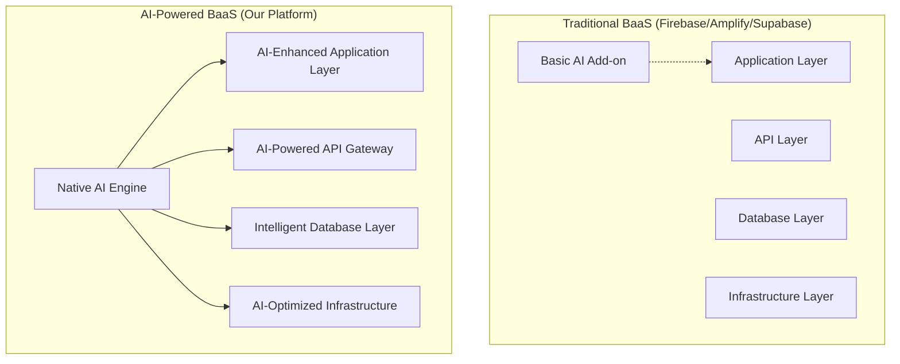

# 🎯 Competitive Analysis: AI-Powered BaaS

## Executive Summary

This document provides a comprehensive analysis of the current BaaS landscape and outlines our strategy to create a superior AI-native backend platform that addresses the fundamental limitations of Firebase, AWS Amplify, Supabase, and other existing solutions.

## 📊 Market Landscape Analysis

### Current BaaS Market Leaders

| Platform | Market Share | Strengths | Key Weaknesses | AI Capabilities |
|----------|-------------|-----------|----------------|-----------------|
| **Firebase** | ~35% | Easy setup, real-time DB, Google integration | Vendor lock-in, limited AI, expensive scaling | Basic ML Kit, no training |
| **AWS Amplify** | ~25% | AWS ecosystem, enterprise features | Complex setup, fragmented AI | External AI services only |
| **Supabase** | ~15% | Open source, PostgreSQL, real-time | Limited AI, manual scaling | Vector DB, OpenAI integration |
| **PocketBase** | ~8% | Lightweight, self-hosted | Limited features, no AI | No AI capabilities |
| **Appwrite** | ~5% | Open source, multi-platform | Basic features, no AI | No AI capabilities |
| **Others** | ~12% | Various niche solutions | Limited adoption | Minimal AI features |

## 🔍 Detailed Competitor Analysis

### 🔥 Firebase (Google)

#### Strengths:
- **Market Leadership**: First-mover advantage in BaaS space
- **Ease of Use**: Simple setup for basic applications
- **Real-time Database**: Solid real-time synchronization
- **Google Integration**: Seamless integration with Google services
- **Authentication**: Comprehensive auth providers

#### Critical Weaknesses:
1. **AI Limitations**:
   - ML Kit is basic and limited to pre-built models
   - No custom model training capabilities
   - No real-time AI inference
   - Limited to Google's AI services

2. **Vendor Lock-in**:
   - Proprietary APIs and data formats
   - GCP-only hosting
   - Difficult migration path
   - No multi-cloud deployment

3. **Cost Unpredictability**:
   - Pay-as-you-go pricing can spiral out of control
   - No fixed pricing for enterprise features
   - Hidden costs for advanced features

4. **Limited Flexibility**:
   - NoSQL-only database
   - No SQL support
   - Limited backend customization
   - No GraphQL native support

#### Our Advantages:
- ✅ Native AI workflows with custom training
- ✅ Multi-cloud and self-hosted deployment
- ✅ Predictable pricing with AI optimization
- ✅ Support for SQL, NoSQL, and graph databases
- ✅ Real-time AI inference at edge locations

### ⚡ AWS Amplify

#### Strengths:
- **AWS Ecosystem**: Access to all AWS services
- **Enterprise Features**: Robust security and compliance
- **Scalability**: Proven enterprise-grade scaling
- **CI/CD Integration**: Good deployment pipelines

#### Critical Weaknesses:
1. **AI Complexity**:
   - Requires deep AWS knowledge for AI features
   - Fragmented across multiple services (SageMaker, Bedrock, etc.)
   - No unified AI development experience
   - Complex setup for simple AI tasks

2. **Developer Experience**:
   - Steep learning curve
   - Over-engineered for simple applications
   - Complex configuration and setup
   - Limited real-time AI capabilities

3. **Cost Complexity**:
   - Complex pricing across multiple services
   - Easy to misconfigure and overspend
   - No AI-powered cost optimization

#### Our Advantages:
- ✅ Unified AI-first development experience
- ✅ Simple setup with powerful AI capabilities
- ✅ AI-powered cost optimization and scaling
- ✅ Real-time AI inference without complex setup

### 🐘 Supabase

#### Strengths:
- **Open Source**: Community-driven development
- **PostgreSQL**: Powerful relational database
- **Real-time Features**: Good real-time subscriptions
- **Developer-Friendly**: Excellent documentation and DX

#### Critical Weaknesses:
1. **Limited AI Capabilities**:
   - Only vector embeddings and similarity search
   - No custom model training
   - Basic OpenAI/Hugging Face integrations
   - No real-time AI inference

2. **Scaling Limitations**:
   - Manual database scaling
   - No AI-powered optimization
   - Limited to PostgreSQL paradigm

3. **AI Infrastructure Gaps**:
   - No edge AI deployment
   - No model marketplace
   - No AI workflow automation
   - Limited to text embeddings

#### Our Advantages:
- ✅ Full AI model training and deployment pipeline
- ✅ Multi-modal AI capabilities (text, image, audio, video)
- ✅ AI-powered automatic scaling and optimization
- ✅ Edge AI deployment for ultra-low latency
- ✅ Visual AI workflow builder

### 📱 PocketBase

#### Strengths:
- **Simplicity**: Single executable, easy deployment
- **Self-hosted**: Full control over infrastructure
- **Lightweight**: Minimal resource requirements

#### Critical Weaknesses:
1. **No AI Capabilities**: Zero AI/ML features
2. **Limited Features**: Basic backend services only
3. **Single Instance**: No built-in scaling
4. **SQLite Limitations**: Not suitable for large-scale applications

#### Our Advantages:
- ✅ Enterprise-grade AI capabilities
- ✅ Auto-scaling with AI optimization
- ✅ Multi-database support with AI recommendations
- ✅ Global edge deployment

## 🚀 Our Competitive Strategy

### 1. **AI-First Architecture**

Unlike competitors who add AI as an afterthought, we build AI capabilities into every layer:



### 2. **Key Differentiators**

#### 🧠 **Native AI Workflows**
- **Visual Pipeline Builder**: Drag-and-drop AI workflow creation
- **Pre-built Templates**: Common AI patterns ready to use
- **Real-time Processing**: Sub-50ms AI inference at the edge
- **Auto-optimization**: AI optimizes AI workflows automatically

#### 🎯 **Custom Model Training**
```python
# One-click model training that competitors can't match
training_job = await aibaas.models.train({
    "data_source": "my_application_data",
    "model_type": "classification",
    "target": "user_sentiment",
    "auto_deploy": True,
    "edge_optimization": True
})
```

#### 📊 **Intelligent Infrastructure**
- **Predictive Scaling**: Forecast traffic 48 hours ahead
- **Cost Optimization**: AI reduces infrastructure costs by 40-60%
- **Performance Prediction**: Prevent bottlenecks before they occur
- **Auto-healing**: Self-repairing infrastructure

#### 🌐 **Edge AI Network**
- **Global Deployment**: 100+ edge locations
- **Offline Capabilities**: AI works without internet
- **Progressive Enhancement**: Seamless cloud-edge model switching
- **Ultra-low Latency**: <50ms response times globally

### 3. **Migration Strategy from Competitors**

#### **From Firebase:**
```javascript
// Easy migration with compatibility layer
import { FirebaseCompat } from '@aibaas/firebase-compat';

// Existing Firebase code works unchanged
const db = FirebaseCompat.firestore();
const doc = await db.collection('users').doc('123').get();

// Enhanced with AI capabilities
const aiEnhanced = await aibaas.enhance(doc.data(), {
  sentiment_analysis: true,
  personalization: true,
  predictive_insights: true
});
```

#### **From Supabase:**
```sql
-- Direct PostgreSQL compatibility
-- Existing Supabase queries work unchanged
SELECT * FROM users WHERE id = $1;

-- Enhanced with AI capabilities
SELECT *, ai_sentiment(bio) as sentiment, 
       ai_recommend_content(user_id) as recommendations 
FROM users WHERE id = $1;
```

#### **From AWS Amplify:**
```typescript
// Simplified migration from complex AWS setup
// Replace 50+ lines of AWS configuration with:
const aibaas = new AIBaaS({
  region: 'us-east-1',
  features: ['auth', 'database', 'storage', 'ai']
});

// Automatic AI enhancement of existing data
await aibaas.migrate.from('amplify', {
  enhance_with_ai: true,
  optimize_performance: true
});
```

## 📈 Market Opportunity

### Total Addressable Market (TAM)
- **BaaS Market**: $15.7B by 2025 (growing at 19.7% CAGR)
- **AI Services Market**: $390B by 2025 (growing at 37.2% CAGR)
- **Combined AI-BaaS Opportunity**: $50B+ by 2027

### Target Customer Segments

1. **Startup Developers** (40% of market)
   - Need: Rapid AI-powered MVP development
   - Pain: Complex AI setup with existing BaaS
   - Solution: One-click AI features and deployment

2. **Enterprise Development Teams** (35% of market)
   - Need: Scalable AI infrastructure without vendor lock-in
   - Pain: Fragmented AI services across multiple platforms
   - Solution: Unified AI-first platform with enterprise compliance

3. **SMB SaaS Companies** (25% of market)
   - Need: Cost-effective AI features to compete
   - Pain: Expensive AI services eating into margins
   - Solution: AI-powered cost optimization and efficient scaling

## 🎯 Go-to-Market Strategy

### Phase 1: Developer Community (Months 1-6)
- **Open Source Core**: Release core platform as open source
- **Developer Advocacy**: Target Firebase/Supabase developers with migration tools
- **AI Showcase**: Demonstrate superior AI capabilities through tutorials and demos

### Phase 2: Enterprise Adoption (Months 7-12)
- **Enterprise Features**: Advanced security, compliance, and management
- **Partnership Program**: Integrate with popular development tools
- **Success Stories**: Case studies showing cost savings and performance improvements

### Phase 3: Market Leadership (Months 13-24)
- **Feature Expansion**: Advanced AI capabilities and industry-specific solutions
- **Global Expansion**: International data centers and compliance
- **Ecosystem Building**: Third-party integrations and marketplace

## 🏆 Success Metrics

### Technical Metrics
- **AI Inference Latency**: <50ms globally (vs 200-500ms competitors)
- **Model Training Time**: <30 minutes (vs hours/days with external services)
- **Cost Efficiency**: 40-60% cost reduction vs traditional BaaS + AI services
- **Uptime**: 99.99% SLA (matching enterprise requirements)

### Business Metrics
- **Developer Adoption**: 10K+ developers in first 6 months
- **Enterprise Customers**: 50+ enterprise clients by month 12
- **Revenue Growth**: $10M ARR by month 18
- **Market Share**: 5% of AI-enhanced BaaS market by month 24

## 🔮 Future Roadmap

### 2025 Q1-Q2: Foundation
- Core platform launch with basic AI capabilities
- Firebase/Supabase migration tools
- Developer documentation and community building

### 2025 Q3-Q4: Enhancement
- Advanced AI features (custom training, edge deployment)
- Enterprise security and compliance features
- Performance optimization and cost management tools

### 2026: Market Expansion
- Industry-specific AI solutions
- Advanced analytics and predictive capabilities
- Global expansion and localization

### 2027+: Innovation Leadership
- Next-generation AI capabilities (AGI integration)
- Quantum computing preparation
- Industry standard setting and ecosystem leadership

## 📞 Conclusion

The current BaaS market has significant gaps in AI capabilities, developer experience, and cost optimization. Our AI-Powered BaaS platform is positioned to capture significant market share by:

1. **Solving Real Problems**: Addressing genuine pain points that developers face daily
2. **Technical Superiority**: Delivering measurably better performance and capabilities
3. **Economic Value**: Providing clear cost savings and ROI
4. **Developer Experience**: Making AI development as easy as traditional backend development

By focusing on AI-first architecture and superior developer experience, we can build the next-generation BaaS platform that developers will choose over existing solutions.

---

*This analysis is updated quarterly to reflect market changes and competitive developments.*
