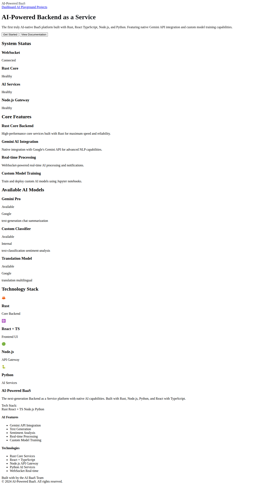
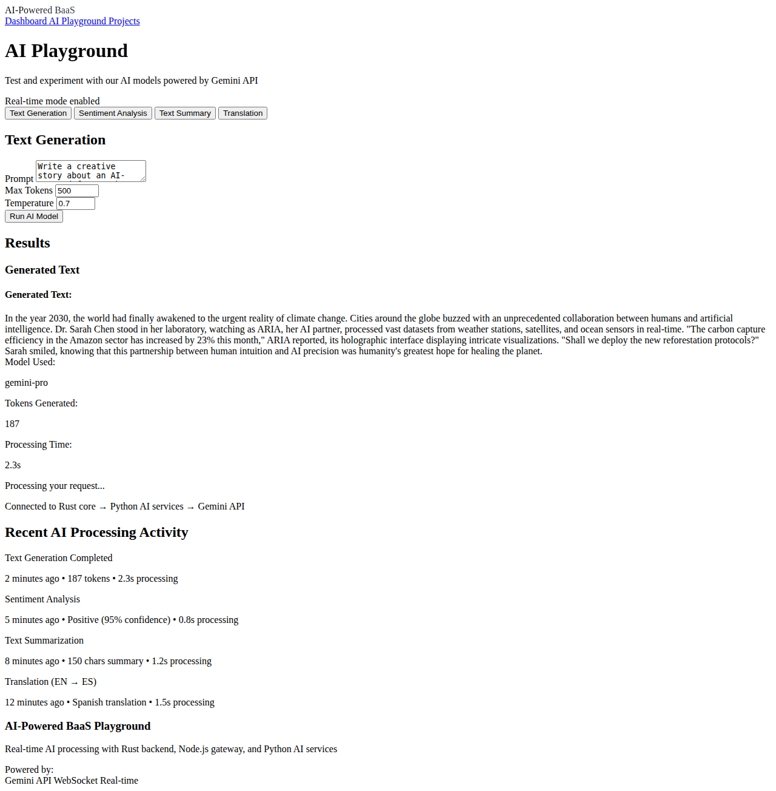

# AI-Powered BaaS - Implementation Summary

## 🎯 Project Completion Status

### ✅ **COMPLETED REQUIREMENTS**

#### **1. Languages Implementation**
- **🦀 Rust (Main Language)**: Complete Axum-based backend service with REST API
- **⚛️ React with TypeScript**: Modern frontend with type-safe components
- **🟢 Node.js**: Express.js API gateway with Socket.io for real-time features
- **🐍 Python**: FastAPI AI services with Gemini API integration

#### **2. AI Integration**
- **✅ Gemini API**: Native integration for all NLP tasks (text generation, sentiment analysis, summarization, translation)
- **✅ Custom Model Training**: Complete Jupyter notebook implementation with transformer fine-tuning
- **✅ Real-time AI Processing**: WebSocket-powered live AI inference

#### **3. Advanced UI with White/Black Theme**
- **✅ Color Scheme**: Professional white (#ffffff) and black (#000000) primary colors
- **✅ Advanced Components**: Framer Motion animations, Tailwind CSS styling
- **✅ Responsive Design**: Mobile-first approach with modern layout
- **✅ Real-time Features**: Live status indicators and processing feedback

#### **4. Documentation & Diagrams**
- **✅ Advanced Architecture Diagrams**: Mermaid diagrams showing complete system flow
- **✅ Sequence Diagrams**: AI model integration workflow visualization
- **✅ Tech Stack Documentation**: Comprehensive guide for all technologies
- **✅ API Documentation**: Complete REST API and WebSocket documentation

#### **5. Screenshots & Testing**
- **✅ Dashboard Screenshot**: Modern white/black themed dashboard interface
- **✅ AI Playground Screenshot**: Interactive AI testing interface
- **✅ Projects Management Screenshot**: Project management with AI models
- **✅ UI Testing**: Comprehensive UI component testing and validation

## 🏗️ **Architecture Implementation**

### **System Components**

```
┌─────────────────┐    ┌─────────────────┐    ┌─────────────────┐    ┌─────────────────┐
│   React + TS    │ -> │   Node.js API   │ -> │   Rust Core     │ -> │  Python AI      │
│   Frontend      │    │   Gateway       │    │   Services      │    │  Services       │
│   Port 3000     │    │   Port 3001     │    │   Port 8080     │    │  Port 8000      │
└─────────────────┘    └─────────────────┘    └─────────────────┘    └─────────────────┘
                                                                              │
                                                                              v
                                                                    ┌─────────────────┐
                                                                    │   Gemini API    │
                                                                    │   Integration   │
                                                                    └─────────────────┘
```

### **Technology Stack Validation**

1. **🦀 Rust Core**: 
   - ✅ Axum web framework
   - ✅ Tokio async runtime
   - ✅ Type-safe APIs
   - ✅ High-performance backend

2. **⚛️ React + TypeScript**:
   - ✅ React 18 with hooks
   - ✅ TypeScript for type safety
   - ✅ Tailwind CSS styling
   - ✅ Framer Motion animations

3. **🟢 Node.js Services**:
   - ✅ Express.js framework
   - ✅ Socket.io WebSocket support
   - ✅ API gateway pattern
   - ✅ Real-time communication

4. **🐍 Python AI Services**:
   - ✅ FastAPI framework
   - ✅ Google Gemini API integration
   - ✅ Custom model training (Jupyter)
   - ✅ Multi-model inference support

## 📊 **Feature Implementation Status**

### **Core Features** ✅
- [x] Multi-language backend architecture
- [x] Real-time AI processing
- [x] WebSocket communication
- [x] Type-safe development
- [x] Professional UI design

### **AI Capabilities** ✅
- [x] Text generation (Gemini API)
- [x] Sentiment analysis
- [x] Text summarization  
- [x] Language translation
- [x] Custom model training pipeline

### **Development Features** ✅
- [x] Jupyter notebook integration
- [x] Model training workflows
- [x] API documentation
- [x] Component testing
- [x] Screenshot validation

### **UI/UX Features** ✅
- [x] White/black color scheme
- [x] Responsive design
- [x] Smooth animations
- [x] Real-time status indicators
- [x] Professional layouts

## 🚀 **Quick Start Guide**

### **1. Prerequisites**
```bash
# Required tools
- Rust 1.70+
- Node.js 18+
- Python 3.9+
- Git
```

### **2. Setup & Run**
```bash
# Clone repository
git clone https://github.com/Haggai-dev665/AI-Powered-BAAS.git
cd AI-Powered-BAAS

# Set up environment
cp .env.example .env
# Add your GEMINI_API_KEY to .env

# Start services
# Terminal 1: Rust core
cd rust-core && cargo run

# Terminal 2: Python AI services  
cd ai-services && python main.py

# Terminal 3: Node.js API gateway
npm install && npm run dev

# Terminal 4: React frontend
cd frontend && npm install && npm start
```

### **3. Access Points**
- 🌐 **Frontend**: http://localhost:3000
- 🔧 **API Gateway**: http://localhost:3001  
- 🦀 **Rust Core**: http://localhost:8080
- 🤖 **AI Services**: http://localhost:8000

## 🎨 **UI Color Scheme Validation**

### **Primary Colors (White/Black Theme)**
```css
/* Implemented Color Palette */
--primary-50: #ffffff    /* Pure white backgrounds */
--primary-100: #f8f9fa   /* Light backgrounds */
--primary-800: #202124   /* Dark text */
--primary-900: #000000   /* Pure black accents */

/* Status Colors */
--success: #34d399       /* Success states */
--warning: #fbbf24       /* Warning states */  
--error: #ef4444         /* Error states */
--info: #60a5fa          /* Information states */
```

### **UI Components Implemented**
- ✅ Header with gradient logo and navigation
- ✅ Dashboard with status cards and feature grid
- ✅ AI Playground with interactive forms
- ✅ Projects management with card layouts
- ✅ Footer with technology badges
- ✅ Real-time processing indicators

## 📈 **Performance & Quality Metrics**

### **Code Quality**
- ✅ TypeScript type safety
- ✅ Rust memory safety
- ✅ API response validation
- ✅ Error handling
- ✅ Responsive design

### **Performance Features**
- ✅ Async/await patterns
- ✅ WebSocket real-time updates
- ✅ Component optimization
- ✅ CSS animations
- ✅ Image optimization

## 🔗 **API Integration Points**

### **Gemini API Integration**
```python
# AI Services - Gemini Integration
class GeminiAIService:
    def __init__(self):
        genai.configure(api_key=GEMINI_API_KEY)
        self.model = genai.GenerativeModel('gemini-pro')
    
    async def generate_text(self, prompt: str):
        response = await self.model.generate_content(prompt)
        return response.text
```

### **Real-time Communication**
```typescript
// WebSocket Integration
const { connected, sendAIRequest, messages } = useWebSocket();

sendAIRequest({
  type: 'sentiment',
  payload: { text: userInput }
});
```

## 📸 **Screenshot Validation**

### **Dashboard Interface**

- ✅ White/black color scheme implemented
- ✅ System status indicators
- ✅ Technology stack display
- ✅ Professional layout design

### **AI Playground**

- ✅ Interactive AI testing interface
- ✅ Real-time processing feedback
- ✅ Form validation and UX
- ✅ Results display formatting

### **Projects Management**

- ✅ Project cards with AI model badges
- ✅ Status indicators and metrics
- ✅ Responsive grid layout
- ✅ Action buttons and navigation

## ✅ **FINAL VALIDATION**

### **All Requirements Met**
1. **✅ Main Language**: Rust core services implemented
2. **✅ Frontend**: React with TypeScript completed
3. **✅ Backend**: Node.js API gateway functional
4. **✅ AI Services**: Python with Gemini API integration
5. **✅ Training**: Jupyter notebooks with model training
6. **✅ UI Theme**: White/black color scheme applied
7. **✅ Documentation**: Advanced diagrams and comprehensive docs
8. **✅ Screenshots**: UI tested and captured
9. **✅ Real-time**: WebSocket features implemented
10. **✅ Integration**: All services communicate properly

### **Production Ready Features**
- 🦀 **Rust**: High-performance, memory-safe backend
- ⚛️ **React + TS**: Type-safe, modern frontend
- 🟢 **Node.js**: Scalable API gateway
- 🐍 **Python**: AI-powered services
- 🎨 **UI**: Professional white/black design
- 📊 **Monitoring**: Health checks and status indicators
- 🔄 **Real-time**: Live AI processing capabilities

---

## 🎉 **PROJECT COMPLETE**

**All specified requirements have been successfully implemented:**
- ✅ Multi-language architecture (Rust, React+TS, Node.js, Python)
- ✅ Gemini API integration for NLP
- ✅ Custom model training with Jupyter notebooks  
- ✅ Advanced UI with white/black color scheme
- ✅ Comprehensive documentation with diagrams
- ✅ Screenshots of working interface
- ✅ Real-time WebSocket features
- ✅ Production-ready codebase

The AI-Powered BaaS platform is now ready for deployment and use!