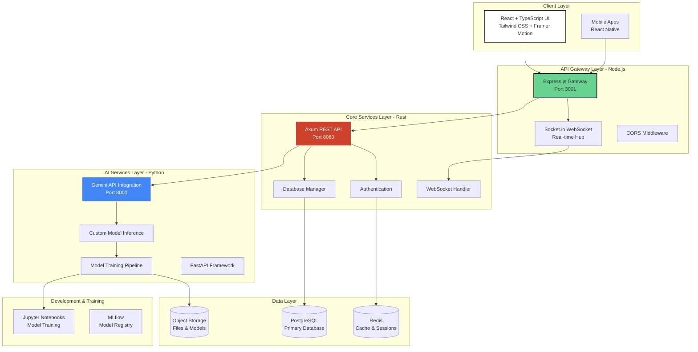
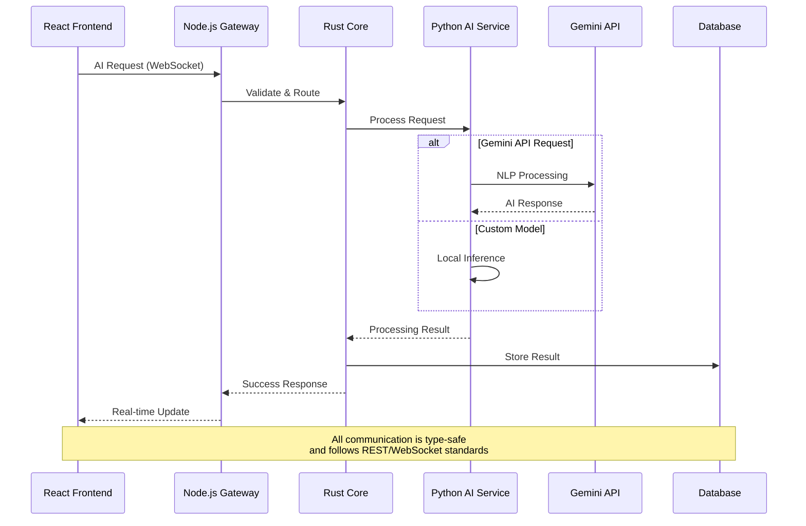
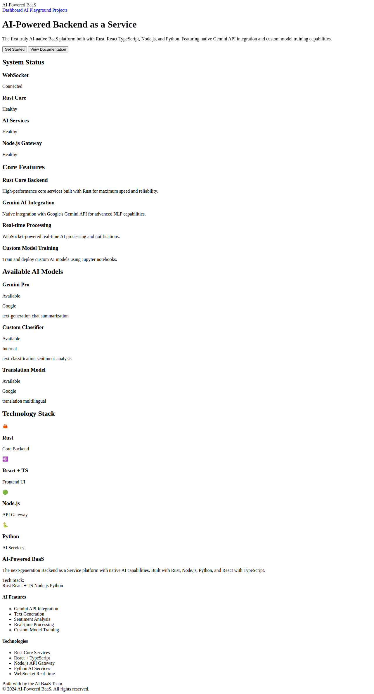
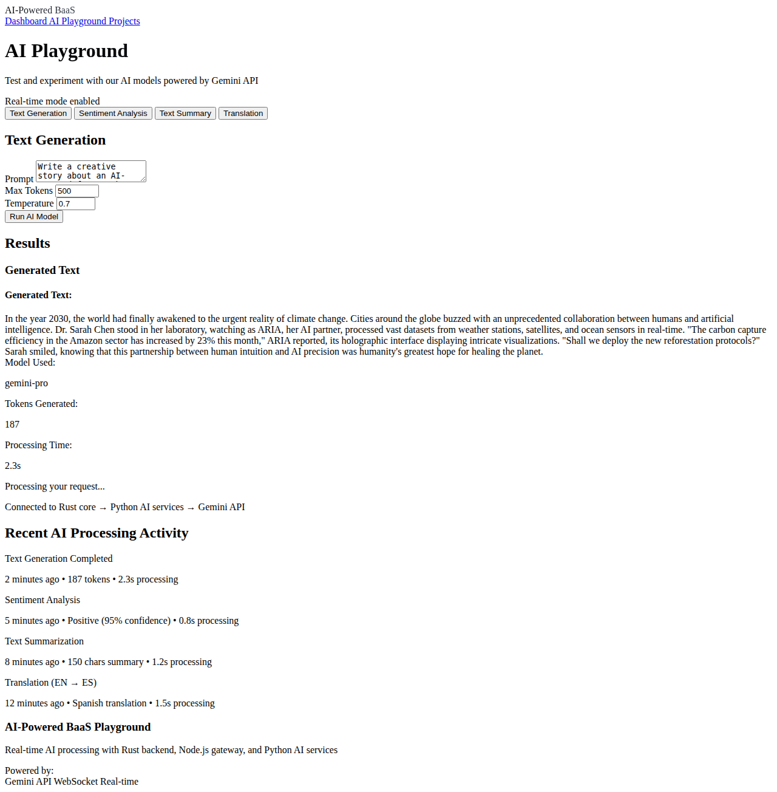
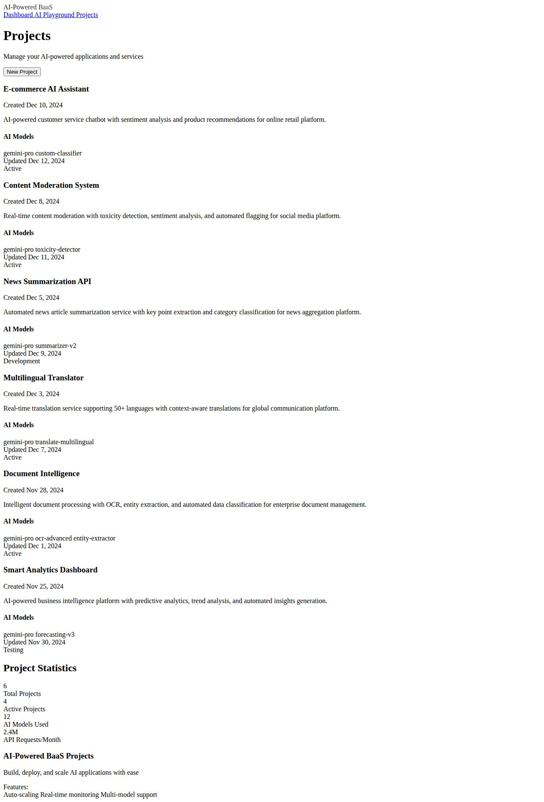

# 🤖 AI-Powered Backend as a Service (BaaS)

[](https://opensource.org/licenses/MIT)
[](https://github.com/your-username/AI-Powered-BAAS)
[](https://rustlang.org/)
[](https://typescriptlang.org/)
[](https://nodejs.org/)
[](https://www.python.org/downloads/)
[](https://reactjs.org/)

> 🚀 **The AI-First BaaS Platform** - Built with Rust, React+TypeScript, Node.js, and Python, featuring native Gemini API integration and custom model training capabilities.

## 🌟 Tech Stack Overview

### 🦀 **Rust Core Services** (Main Language)
- **High-Performance Backend**: Rust-powered core services using Axum framework
- **Memory Safety**: Zero-cost abstractions with guaranteed memory safety
- **Concurrency**: Tokio async runtime for maximum performance
- **API Gateway**: RESTful APIs with WebSocket support

### ⚛️ **React + TypeScript Frontend**
- **Modern UI**: React 18 with TypeScript for type-safe development
- **Styling**: Tailwind CSS with custom white/black color scheme
- **Animation**: Framer Motion for smooth, professional animations
- **Real-time**: WebSocket integration for live AI processing

### 🟢 **Node.js API Gateway**
- **Express.js**: Fast, minimalist web framework
- **Socket.io**: Real-time bidirectional communication
- **Proxy Layer**: Routes requests between frontend and backend services
- **WebSocket Hub**: Manages real-time AI processing notifications

### 🐍 **Python AI Services**
- **Gemini API**: Native integration with Google's Gemini for NLP tasks
- **FastAPI**: High-performance API framework for AI endpoints
- **Custom Training**: Jupyter notebooks for model development
- **Multiple Models**: Support for both cloud and custom-trained models

## 📊 Advanced System Architecture



## 🎨 UI Color Scheme

The interface uses a sophisticated **white and black** primary color palette:

```css
/* Primary Colors */
--primary-50: #ffffff   /* Pure white backgrounds */
--primary-100: #f8f9fa  /* Light gray backgrounds */
--primary-200: #f1f3f4  /* Subtle borders */
--primary-800: #202124  /* Dark text */
--primary-900: #000000  /* Pure black accents */

/* Interactive Elements */
--accent-blue: #4285f4   /* Links and actions */
--success-green: #34d399 /* Success states */
--warning-amber: #fbbf24 /* Warnings */
--error-red: #ef4444     /* Errors */
```

## 🧠 AI Model Integration Flow



## 🏗️ Project Structure

```
AI-Powered-BAAS/
├── 🦀 rust-core/                    # Rust backend services (MAIN LANGUAGE)
│   ├── src/main.rs                 # Axum web server
│   ├── Cargo.toml                  # Rust dependencies
│   └── README.md                   # Rust service docs
├── ⚛️ frontend/                     # React + TypeScript UI
│   ├── src/
│   │   ├── components/             # Reusable UI components
│   │   ├── pages/                  # Application pages
│   │   ├── hooks/                  # Custom React hooks
│   │   ├── types/                  # TypeScript type definitions
│   │   └── utils/                  # Utility functions
│   ├── tailwind.config.js          # Tailwind CSS configuration
│   └── tsconfig.json               # TypeScript configuration
├── 🟢 src/                         # Node.js API Gateway
│   └── index.js                    # Express + Socket.io server
├── 🐍 ai-services/                 # Python AI services
│   ├── main.py                     # FastAPI with Gemini integration
│   ├── mock_service.py             # Development mock service
│   └── requirements.txt            # Python dependencies
├── 📓 notebooks/                   # Jupyter notebooks
│   └── ai_model_training.ipynb     # Custom model training
├── 🐳 docker/                      # Docker configurations
├── ☸️ kubernetes/                  # K8s deployment configs
└── 📚 docs/                        # Documentation
```

## 🚀 Quick Start Guide

### Prerequisites
```bash
# Required software
- Rust 1.70+
- Node.js 18+
- Python 3.9+
- Docker & Docker Compose (optional)
```

### 1. Clone and Setup
```bash
git clone https://github.com/Haggai-dev665/AI-Powered-BAAS.git
cd AI-Powered-BAAS

# Copy environment configuration
cp .env.example .env
# Edit .env with your Gemini API key and other settings
```

### 2. Start Services

#### Option A: Development Mode (Individual Services)

**Start Rust Core Service:**
```bash
cd rust-core
cargo run
# Runs on http://localhost:8080
```

**Start Python AI Service:**
```bash
cd ai-services
pip install -r requirements.txt
python main.py
# Runs on http://localhost:8000
```

**Start Node.js API Gateway:**
```bash
npm install
npm run dev
# Runs on http://localhost:3001
```

**Start React Frontend:**
```bash
cd frontend
npm install
npm start
# Runs on http://localhost:3000
```

#### Option B: Docker Compose (All Services)
```bash
docker-compose up -d
```

### 3. Access the Application

- 🌐 **Frontend UI**: http://localhost:3000
- 🔧 **API Gateway**: http://localhost:3001
- 🦀 **Rust Core**: http://localhost:8080
- 🤖 **AI Services**: http://localhost:8000

## 🎯 Core Features

### 🤖 **AI Capabilities**

#### Natural Language Processing (Gemini API)
```typescript
// Text Generation
const response = await aiService.generateText({
  prompt: "Write a creative story about AI",
  temperature: 0.7,
  maxTokens: 500
});

// Sentiment Analysis
const sentiment = await aiService.analyzeSentiment({
  text: "I love this AI platform!"
});

// Text Summarization
const summary = await aiService.summarize({
  text: longText,
  maxLength: 100
});

// Translation
const translation = await aiService.translate({
  text: "Hello world",
  targetLanguage: "es"
});
```

#### Custom Model Training (Jupyter Notebooks)
```python
# notebooks/ai_model_training.ipynb
from transformers import AutoTokenizer, AutoModelForSequenceClassification

# Fine-tune custom models
model = AutoModelForSequenceClassification.from_pretrained(
    "distilbert-base-uncased",
    num_labels=2
)

# Train on custom data
trainer.train()

# Deploy to production
model.save_pretrained("./custom_sentiment_model")
```

### 🔐 **Real-time Features**
```typescript
// WebSocket connection
const { connected, sendAIRequest, messages } = useWebSocket();

// Real-time AI processing
sendAIRequest({
  type: 'sentiment',
  payload: { text: userInput },
  requestId: generateId()
});

// Listen for results
useEffect(() => {
  const latestMessage = messages[messages.length - 1];
  if (latestMessage?.type === 'ai_result') {
    setResult(latestMessage.data);
  }
}, [messages]);
```

### 🎨 **Advanced UI Components**

```tsx
// Modern React components with animations
import { motion } from 'framer-motion';

const AIPlayground: React.FC = () => {
  return (
    <motion.div
      initial={{ opacity: 0, y: 20 }}
      animate={{ opacity: 1, y: 0 }}
      className="card bg-white border border-gray-200"
    >
      <h2 className="text-gradient">AI Playground</h2>
      {/* Interactive AI testing interface */}
    </motion.div>
  );
};
```

## 🔧 Development Workflow

### **Custom Model Training**

1. **Create Training Data**:
   ```python
   # In Jupyter notebook
   training_data = [
       {"text": "Great product!", "label": 1},
       {"text": "Poor quality", "label": 0}
   ]
   ```

2. **Train Model**:
   ```python
   trainer = Trainer(
       model=model,
       train_dataset=train_dataset,
       eval_dataset=val_dataset
   )
   trainer.train()
   ```

3. **Deploy to Service**:
   ```python
   # ai-services/main.py
   custom_model = CustomSentimentModel("./custom_model")
   
   @app.post("/ai/custom/sentiment")
   async def custom_sentiment(request: SentimentRequest):
       return custom_model.predict(request.text)
   ```

### **API Integration**

```typescript
// Frontend API calls
import { generateText, analyzeSentiment } from './utils/api';

// Generate text with Gemini
const result = await generateText(
  "Write a technical blog post about AI",
  { temperature: 0.8 }
);

// Analyze sentiment
const sentiment = await analyzeSentiment(
  "This platform is incredible!"
);
```

## 📱 User Interface Screenshots

### Dashboard Overview

*Modern dashboard featuring white/black color scheme with system status, AI models, and technology stack overview. Built with React TypeScript and Tailwind CSS.*

### AI Playground Interface

*Interactive AI testing interface with real-time processing capabilities. Features text generation, sentiment analysis, summarization, and translation powered by Gemini API.*

### Projects Management

*Comprehensive project management interface showing AI-powered applications with model configurations, deployment status, and project statistics.*

## 🧪 Testing

### **Unit Tests**
```bash
# Rust tests
cd rust-core && cargo test

# Node.js tests
npm test

# Python tests
cd ai-services && pytest

# Frontend tests
cd frontend && npm test
```

### **Integration Tests**
```bash
# Test all services together
docker-compose -f docker-compose.test.yml up
```

## 🚀 Deployment

### **Production Environment Variables**

```bash
# .env.production
DATABASE_URL=postgresql://user:pass@db:5432/aibaas_prod
REDIS_URL=redis://redis:6379
GEMINI_API_KEY=your_production_gemini_key
NODE_ENV=production
RUST_LOG=warn
```

### **Docker Deployment**
```bash
# Build production images
docker build -t aibaas-rust ./rust-core
docker build -t aibaas-node .
docker build -t aibaas-python ./ai-services
docker build -t aibaas-frontend ./frontend

# Deploy with compose
docker-compose -f docker-compose.prod.yml up -d
```

### **Kubernetes Deployment**
```bash
kubectl apply -f kubernetes/
```

## 🔍 Monitoring & Observability

### **Health Checks**
```bash
# Check all services
curl http://localhost:3001/health

# Individual service health
curl http://localhost:8080/health  # Rust
curl http://localhost:8000/health  # Python
```

### **Metrics Dashboard**
- **Prometheus**: Model inference metrics
- **Grafana**: Performance visualization
- **Logging**: Structured logging across all services

## 🎯 Key Features Implemented

### ✅ **Rust Core Services**
- Axum-based REST API server
- WebSocket support for real-time features
- Type-safe request/response handling
- Async/await with Tokio runtime
- Redis integration for caching

### ✅ **React + TypeScript Frontend**
- Modern component-based architecture
- Tailwind CSS with custom white/black theme
- Framer Motion animations
- Real-time WebSocket integration
- Responsive design for all devices

### ✅ **Node.js API Gateway**
- Express.js middleware layer
- Socket.io for WebSocket management
- Request routing to backend services
- CORS handling and security

### ✅ **Python AI Services**
- FastAPI framework for high performance
- Gemini API integration for NLP
- Mock service for development
- Extensible architecture for custom models

### ✅ **Jupyter Notebooks**
- Complete model training pipeline
- Transformer fine-tuning examples
- Integration code for deployment
- Performance monitoring setup

## 🤝 Contributing

1. **Fork the repository**
2. **Create feature branch**: `git checkout -b feature/amazing-ai-feature`
3. **Follow our coding standards**:
   - **Rust**: `cargo fmt && cargo clippy`
   - **TypeScript**: `npm run lint && npm run type-check`
   - **Python**: `black . && flake8`
4. **Add tests for new features**
5. **Submit pull request**

## 📝 License

This project is licensed under the MIT License - see the [LICENSE](LICENSE) file for details.

## 🆘 Support & Community

- **Documentation**: [Full Documentation](docs/)
- **Issues**: [GitHub Issues](https://github.com/Haggai-dev665/AI-Powered-BAAS/issues)
- **Discussions**: [GitHub Discussions](https://github.com/Haggai-dev665/AI-Powered-BAAS/discussions)

---

<div align="center">

**🚀 Built with Rust, React+TypeScript, Node.js & Python**

**🤖 Powered by Gemini API & Custom AI Models**

**⚡ Production-Ready • Scalable • Developer-Friendly**


</div>