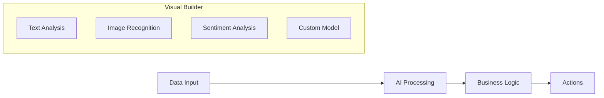
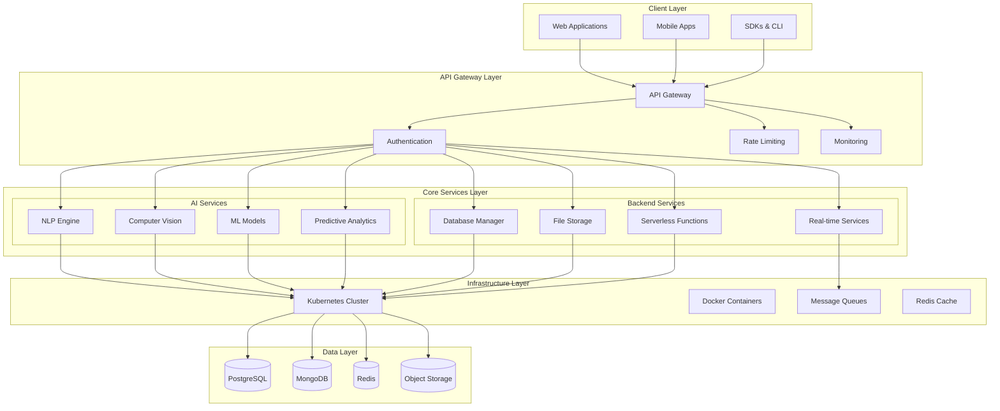
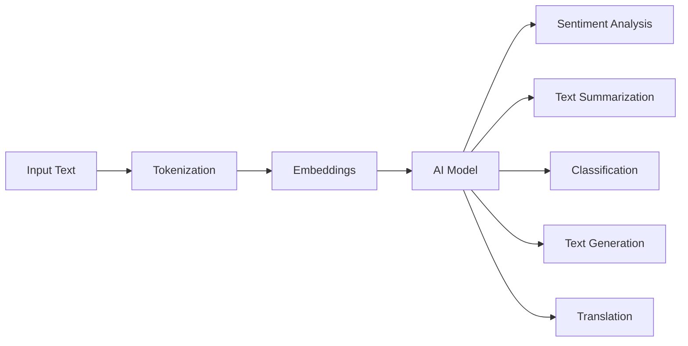
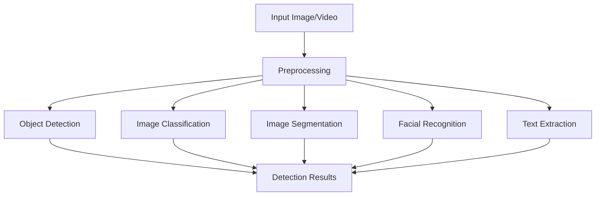
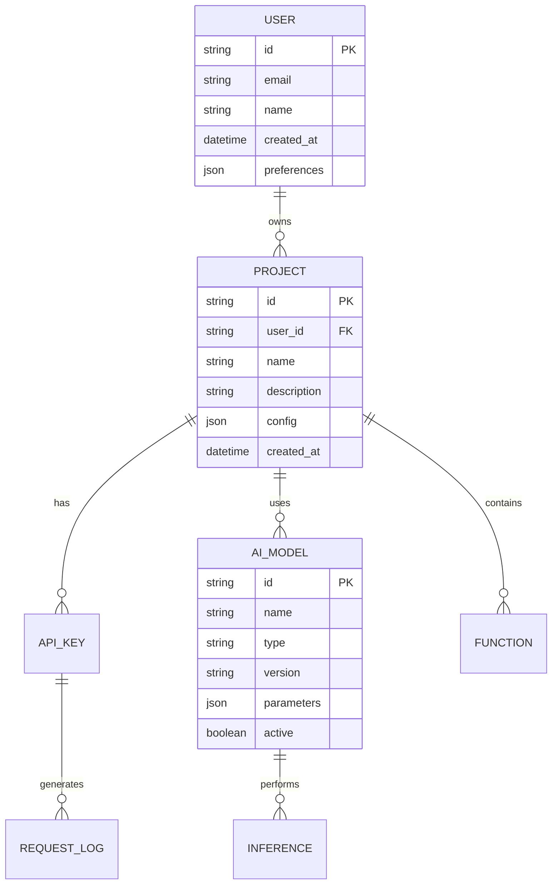

# 🤖 AI-Powered Backend as a Service (BaaS)

[](https://opensource.org/licenses/MIT)
[](https://github.com/your-username/AI-Powered-BAAS)
[](https://www.python.org/downloads/)
[](https://nodejs.org/)
[](https://docker.com)

> 🚀 **The AI-First BaaS That Surpasses Firebase, AWS Amplify, and Supabase** - The only backend platform with native AI workflows, custom model training, and intelligent automation that scales from prototype to enterprise.

## 🌟 Overview

**AI-Powered BaaS** is the first truly AI-native backend platform designed to surpass existing BaaS solutions like Firebase, AWS Amplify, and Supabase. While traditional BaaS platforms offer basic AI integrations as an afterthought, we've built AI capabilities from the ground up, providing developers with unparalleled intelligent backend services.

### 🎯 Vision Statement

*"To be the first AI-native BaaS platform that not only matches traditional backend services but revolutionizes them with intelligent automation, predictive scaling, and custom AI model deployment capabilities that make every application smarter by default."*

## 💡 Why Choose AI-Powered BaaS Over Competitors?

### 🔥 **Unique Value Propositions**

| Feature | AI-Powered BaaS | Firebase | AWS Amplify | Supabase |
|---------|-----------------|----------|-------------|----------|
| **Native AI Workflows** | ✅ Built-in | ❌ Basic ML Kit | ❌ Limited AI | ❌ Basic Vector DB |
| **Custom Model Training** | ✅ Full Pipeline | ❌ No Training | ❌ External Only | ❌ No Training |
| **Intelligent Scaling** | ✅ AI-Driven | ⚠️ Manual Config | ⚠️ Manual Config | ⚠️ Manual Config |
| **Predictive Analytics** | ✅ Real-time | ❌ External Tools | ❌ External Tools | ❌ Limited |
| **AI-Powered Security** | ✅ Behavioral Analysis | ⚠️ Basic Rules | ⚠️ Basic Rules | ⚠️ Basic Rules |
| **Multi-Model Support** | ✅ 50+ Models | ❌ Limited | ❌ Limited | ❌ Vector Only |
| **Edge AI Deployment** | ✅ Global CDN | ❌ No Edge AI | ❌ No Edge AI | ❌ No Edge AI |
| **No-Code AI Pipelines** | ✅ Visual Builder | ❌ Code Required | ❌ Code Required | ❌ Code Required |

### 🚫 **Competitor Limitations We Solve**

#### **Firebase Limitations:**
- **AI Afterthought**: ML Kit is basic, no custom training, limited models
- **Vendor Lock-in**: Google Cloud only, proprietary APIs
- **Unpredictable Costs**: Pay-as-you-go can become expensive at scale
- **Limited Hosting**: Only GCP, no multi-cloud deployment
- **Basic Real-time**: Simple updates, no AI-powered streams

#### **AWS Amplify Limitations:**
- **Complex AI Setup**: Requires deep AWS knowledge for AI features
- **Fragmented Services**: AI scattered across multiple AWS services
- **Enterprise Complexity**: Over-engineered for simple AI use cases
- **No Custom Training**: External model training required
- **Limited Real-time AI**: No real-time model inference

#### **Supabase Limitations:**
- **Vector-Only AI**: Limited to vector embeddings and search
- **No Model Training**: Cannot train custom models
- **Basic AI Features**: Only OpenAI integrations, no custom pipelines
- **Limited Scaling**: Manual database scaling, no AI optimization
- **Postgres-Centric**: Limited NoSQL and multi-model support

## 🚀 **Advanced Differentiating Features**

### 🧠 **1. Native AI Workflow Engine**
```javascript
// Create intelligent data processing pipelines with visual builder
const pipeline = await aibaas.workflows.create({
  name: "Smart Content Moderation",
  triggers: ["content.uploaded"],
  steps: [
    { type: "ai.text-analysis", model: "toxicity-detector-v2" },
    { type: "ai.image-analysis", model: "nsfw-classifier" },
    { type: "database.update", collection: "content" },
    { type: "notification.send", condition: "flagged" }
  ],
  ai_optimization: true
});
```

### 🎯 **2. Custom Model Training Pipeline**
```python
# Train custom models directly in the platform
training_job = await aibaas.ai.train_model({
    "model_type": "text_classifier",
    "dataset": "gs://my-bucket/training-data",
    "base_model": "bert-base-uncased",
    "target_accuracy": 0.95,
    "auto_deploy": true,
    "edge_optimization": true
})
```

### 📊 **3. Intelligent Predictive Scaling**
- **AI-Driven Resource Management**: Predict traffic spikes 24-48 hours in advance
- **Smart Cost Optimization**: Automatically scale down during low usage periods
- **Performance Predictions**: Machine learning models predict bottlenecks before they occur
- **Anomaly Detection**: Real-time detection of unusual traffic patterns or security threats

### 🔒 **4. AI-Powered Security & Compliance**
```javascript
// Behavioral security analysis with AI
const security = await aibaas.security.configure({
  behavioral_analysis: {
    enabled: true,
    anomaly_threshold: 0.85,
    auto_block_suspicious: true
  },
  compliance: {
    gdpr: true,
    hipaa: true,
    auto_anonymization: true
  },
  threat_detection: {
    sql_injection: "ai_enhanced",
    ddos_protection: "ml_based",
    fraud_detection: "real_time"
  }
});
```

### 🌐 **5. Edge AI Deployment Network**
- **Global AI Inference**: Deploy models to 100+ edge locations worldwide
- **Sub-50ms Latency**: AI responses faster than traditional cloud calls
- **Offline-First AI**: Models work without internet connectivity
- **Progressive Enhancement**: Seamlessly upgrade from edge to cloud models

### 🎨 **6. No-Code AI Pipeline Builder**


### 🔄 **7. Real-Time AI Streams**
```javascript
// Real-time AI processing streams
const stream = aibaas.streams.create({
  source: "user_interactions",
  processors: [
    "ai.sentiment_analysis",
    "ai.intent_detection",
    "ai.personalization"
  ],
  real_time: true,
  latency_target: "10ms"
});

stream.on('ai_result', (data) => {
  // React to AI insights in real-time
  console.log('AI Analysis:', data.sentiment, data.intent);
});
```

### 🤖 **8. Multi-Model AI Ecosystem**
- **50+ Pre-trained Models**: Ready-to-use for common tasks
- **Model Marketplace**: Community-contributed and enterprise models
- **A/B Test Models**: Compare model performance automatically
- **Model Versioning**: Track, rollback, and manage model deployments
- **Ensemble Learning**: Combine multiple models for better accuracy

### 📈 **9. Intelligent Analytics & Insights**
```javascript
// AI-powered analytics that predict user behavior
const insights = await aibaas.analytics.predict({
  metric: "user_churn",
  timeframe: "30_days",
  confidence_level: 0.9,
  actions: ["send_retention_campaign", "offer_discount"]
});
```

### 🔧 **10. Smart Infrastructure Management**
- **Auto-Healing Systems**: AI detects and fixes common issues automatically
- **Predictive Maintenance**: Prevent downtime with ML-powered monitoring
- **Resource Optimization**: AI automatically optimizes database queries and API performance
- **Smart Caching**: ML determines optimal caching strategies per application

## 📊 Platform Architecture



## 🎨 Technology Stack

### Frontend & Client SDKs
- **React.js 18+** - Modern web applications
- **React Native** - Cross-platform mobile development
- **TypeScript** - Type-safe development
- **Tailwind CSS** - Utility-first styling

### Backend Services
- **Node.js 18+** - Primary API server and real-time services
- **Express.js** - Web framework
- **Socket.io** - Real-time communication
- **GraphQL** - Flexible API queries

### AI/ML Services
- **Python 3.9+** - AI model development and inference
- **FastAPI** - High-performance AI API endpoints
- **TensorFlow 2.x** - Deep learning models
- **PyTorch** - Research and production ML models
- **Hugging Face Transformers** - Pre-trained NLP models
- **OpenCV** - Computer vision processing
- **scikit-learn** - Traditional ML algorithms

### Infrastructure & DevOps
- **Docker & Kubernetes** - Containerization and orchestration
- **Redis** - Caching and session management
- **PostgreSQL** - Primary relational database
- **MongoDB** - Document storage
- **MinIO/S3** - Object storage
- **Apache Kafka** - Event streaming
- **Prometheus & Grafana** - Monitoring and observability

## 🧠 AI Capabilities

### Natural Language Processing (NLP)


**Available Models:**
- **Sentiment Analysis** - Real-time emotion detection
- **Text Summarization** - Automatic content summarization
- **Language Translation** - 50+ language support
- **Named Entity Recognition** - Extract entities from text
- **Question Answering** - Intelligent Q&A systems
- **Text Classification** - Custom category classification
- **Chatbot Engine** - Conversational AI

### Computer Vision


**Available Models:**
- **Object Detection** - YOLO v8, SSD, R-CNN variants
- **Image Classification** - ResNet, EfficientNet, Vision Transformers
- **Facial Recognition** - Face detection, verification, identification
- **OCR (Optical Character Recognition)** - Text extraction from images
- **Image Segmentation** - Pixel-level object identification
- **Style Transfer** - Artistic image transformation

### Predictive Analytics
- **Time Series Forecasting** - LSTM, ARIMA, Prophet models
- **Anomaly Detection** - Isolation Forest, One-Class SVM
- **Recommendation Systems** - Collaborative and content-based filtering
- **Risk Assessment** - Credit scoring, fraud detection
- **Demand Prediction** - Inventory and resource planning

## 🏗️ Core Features

### 🔐 Authentication & Security
- **OAuth 2.0 / OpenID Connect** - Industry-standard authentication
- **JWT Tokens** - Stateless authentication
- **Multi-Factor Authentication (MFA)** - Enhanced security
- **Role-Based Access Control (RBAC)** - Granular permissions
- **API Key Management** - Secure API access
- **Data Encryption** - AES-256 encryption at rest and in transit

### 📊 Database Services


### ⚡ Serverless Functions
- **Custom Business Logic** - Deploy your own functions
- **Event-Driven Architecture** - Trigger-based execution
- **Auto-Scaling** - Scales from zero to millions
- **Multiple Runtimes** - Node.js, Python, Go support
- **Environment Variables** - Secure configuration management

### 🔄 Real-time Services
- **WebSocket Connections** - Bi-directional communication
- **Server-Sent Events** - Live data streaming
- **Real-time Notifications** - Push notifications
- **Live Collaboration** - Multi-user synchronization
- **Event Broadcasting** - Pub/Sub messaging

## 🚀 Quick Start

### Prerequisites
```bash
# Required software
- Node.js 18+ 
- Python 3.9+
- Docker & Docker Compose
- Git
```

### 1. Clone and Setup
```bash
# Clone the repository
git clone https://github.com/your-username/AI-Powered-BAAS.git
cd AI-Powered-BAAS

# Install dependencies
npm install
pip install -r requirements.txt

# Setup environment variables
cp .env.example .env
# Edit .env with your configuration
```

### 2. Start Development Environment
```bash
# Start all services with Docker Compose
docker-compose up -d

# Or start services individually
npm run dev          # Start Node.js API server
npm run start:ai     # Start Python AI services
npm run start:web    # Start React frontend
```

### 3. Verify Installation
```bash
# Check API health
curl http://localhost:3000/health

# Test AI endpoint
curl -X POST http://localhost:8000/ai/sentiment \
  -H "Content-Type: application/json" \
  -d '{"text": "I love this AI platform!"}'
```

## 📚 API Documentation

### Authentication
```typescript
// Get access token
POST /auth/login
{
  "email": "user@example.com",
  "password": "your-password"
}

// Response
{
  "access_token": "eyJhbGciOiJIUzI1NiIsInR5cCI6IkpXVCJ9...",
  "refresh_token": "eyJhbGciOiJIUzI1NiIsInR5cCI6IkpXVCJ9...",
  "expires_in": 3600
}
```

### AI Services Examples

#### Sentiment Analysis
```typescript
POST /ai/sentiment
Authorization: Bearer <your-token>
Content-Type: application/json

{
  "text": "This product is amazing!",
  "language": "en"
}

// Response
{
  "sentiment": "positive",
  "confidence": 0.94,
  "scores": {
    "positive": 0.94,
    "negative": 0.04,
    "neutral": 0.02
  }
}
```

#### Object Detection
```typescript
POST /ai/vision/detect
Authorization: Bearer <your-token>
Content-Type: multipart/form-data

{
  "image": <file>,
  "confidence_threshold": 0.5
}

// Response
{
  "objects": [
    {
      "class": "person",
      "confidence": 0.87,
      "bbox": [100, 150, 200, 400]
    },
    {
      "class": "car",
      "confidence": 0.93,
      "bbox": [300, 200, 500, 350]
    }
  ]
}
```

#### Text Generation
```typescript
POST /ai/text/generate
Authorization: Bearer <your-token>
Content-Type: application/json

{
  "prompt": "Write a product description for a smart watch",
  "max_length": 100,
  "temperature": 0.7
}

// Response
{
  "generated_text": "Introducing the next generation smart watch that seamlessly blends style with functionality...",
  "model_used": "gpt-3.5-turbo",
  "tokens_used": 87
}
```

## 🛠️ SDK Examples

### JavaScript/TypeScript SDK
```typescript
import { AIBaaSClient } from '@ai-baas/sdk';

const client = new AIBaaSClient({
  apiKey: 'your-api-key',
  baseURL: 'https://api.aibaas.dev'
});

// Sentiment analysis
const sentiment = await client.ai.sentiment({
  text: "I love this service!"
});

// Object detection
const detection = await client.ai.vision.detect({
  imageUrl: "https://example.com/image.jpg"
});

// Real-time connection
const socket = client.realtime.connect();
socket.on('ai-result', (data) => {
  console.log('AI processing complete:', data);
});
```

### Python SDK
```python
from aibaas import AIBaaSClient

client = AIBaaSClient(
    api_key="your-api-key",
    base_url="https://api.aibaas.dev"
)

# Text summarization
summary = client.ai.summarize(
    text="Your long text here...",
    max_length=100
)

# Image classification
classification = client.ai.vision.classify(
    image_path="./image.jpg"
)

# Async processing
async def process_batch():
    results = await client.ai.batch_process(
        tasks=[
            {"type": "sentiment", "text": "Great product!"},
            {"type": "translate", "text": "Hello", "target": "es"}
        ]
    )
```

## 🏢 Use Cases & Industries

### E-commerce
- **Product Recommendation** - Personalized shopping experiences
- **Review Analysis** - Sentiment analysis of customer feedback
- **Visual Search** - Find products using images
- **Chatbot Support** - Automated customer service

### Healthcare
- **Medical Image Analysis** - Radiology and pathology assistance
- **Symptom Checker** - AI-powered health assessments
- **Drug Discovery** - Molecular analysis and prediction
- **Patient Monitoring** - Real-time health data analysis

### Finance
- **Fraud Detection** - Real-time transaction monitoring
- **Credit Scoring** - AI-powered risk assessment
- **Algorithmic Trading** - Market prediction models
- **Document Processing** - Automated form recognition

### Education
- **Content Generation** - Automated course material creation
- **Student Assessment** - Intelligent grading systems
- **Language Learning** - Pronunciation and grammar checking
- **Plagiarism Detection** - Content originality verification

## 📈 Pricing & Plans

| Feature | Starter | Professional | Enterprise |
|---------|---------|--------------|------------|
| **AI API Calls** | 10K/month | 100K/month | Unlimited |
| **Storage** | 1GB | 10GB | Unlimited |
| **Custom Models** | ❌ | ✅ | ✅ |
| **Priority Support** | ❌ | ✅ | ✅ |
| **SLA** | 99.5% | 99.9% | 99.99% |
| **Price** | Free | $99/month | Contact Us |

### Usage-Based Pricing
- **Text Processing**: $0.001 per 1K characters
- **Image Processing**: $0.01 per image
- **Model Training**: $0.10 per compute hour
- **Storage**: $0.02 per GB/month
- **Bandwidth**: $0.05 per GB

## 🔧 Development & Deployment

### Local Development
```bash
# Development mode with hot reload
npm run dev

# Run tests
npm test
python -m pytest tests/

# Code formatting
npm run format
black . --line-length 88

# Type checking
npm run type-check
mypy src/
```

### Production Deployment

#### Docker Deployment
```bash
# Build production images
docker build -t aibaas-api .
docker build -t aibaas-ai ./ai-services

# Deploy with Docker Compose
docker-compose -f docker-compose.prod.yml up -d
```

#### Kubernetes Deployment
```yaml
# kubernetes/deployment.yaml
apiVersion: apps/v1
kind: Deployment
metadata:
  name: aibaas-api
spec:
  replicas: 3
  selector:
    matchLabels:
      app: aibaas-api
  template:
    metadata:
      labels:
        app: aibaas-api
    spec:
      containers:
      - name: api
        image: aibaas-api:latest
        ports:
        - containerPort: 3000
        env:
        - name: DATABASE_URL
          valueFrom:
            secretKeyRef:
              name: aibaas-secrets
              key: database-url
```

### CI/CD Pipeline
```yaml
# .github/workflows/deploy.yml
name: Deploy to Production
on:
  push:
    branches: [main]

jobs:
  test:
    runs-on: ubuntu-latest
    steps:
      - uses: actions/checkout@v3
      - name: Run tests
        run: |
          npm test
          python -m pytest
  
  deploy:
    needs: test
    runs-on: ubuntu-latest
    steps:
      - name: Deploy to Kubernetes
        run: |
          kubectl apply -f kubernetes/
```

## 🔍 Monitoring & Observability

### Performance Metrics
```mermaid
dashboard "AI BaaS Monitoring"
    time_range "Last 24 hours"
    
    graph "API Response Time" {
        metric "avg_response_time"
        unit "ms"
        target 200
    }
    
    graph "AI Model Accuracy" {
        metric "model_accuracy"
        unit "%"
        target 95
    }
    
    graph "System Resource Usage" {
        metric "cpu_usage"
        metric "memory_usage"
        metric "gpu_usage"
        unit "%"
    }
```

### Health Checks
```typescript
// Health endpoint
GET /health

// Response
{
  "status": "healthy",
  "timestamp": "2025-05-29T10:30:00Z",
  "services": {
    "database": "healthy",
    "redis": "healthy",
    "ai_services": "healthy",
    "storage": "healthy"
  },
  "metrics": {
    "uptime": 3600,
    "requests_per_minute": 150,
    "average_response_time": 185
  }
}
```

## 🤝 Contributing

We welcome contributions from the community! Please read our [Contributing Guide](CONTRIBUTING.md) for details on our development process.

### Development Setup
1. Fork the repository
2. Create a feature branch (`git checkout -b feature/amazing-feature`)
3. Make your changes
4. Add tests for your changes
5. Ensure all tests pass
6. Commit your changes (`git commit -m 'Add amazing feature'`)
7. Push to your branch (`git push origin feature/amazing-feature`)
8. Open a Pull Request

### Code Style
- **JavaScript/TypeScript**: ESLint + Prettier
- **Python**: Black + isort + flake8
- **Documentation**: Markdown with proper formatting

## 📝 License

This project is licensed under the MIT License - see the [LICENSE](LICENSE) file for details.

## 🆘 Support & Community

- **Documentation**: [https://docs.aibaas.dev](https://docs.aibaas.dev)
- **Discord Community**: [Join our Discord](https://discord.gg/aibaas)
- **GitHub Discussions**: [Ask questions](https://github.com/your-username/AI-Powered-BAAS/discussions)
- **Email Support**: support@aibaas.dev
- **Status Page**: [https://status.aibaas.dev](https://status.aibaas.dev)

## 🎯 Roadmap

### Q2 2025
- [ ] Advanced NLP models (GPT-4, Claude integration)
- [ ] Real-time video processing
- [ ] Custom model training platform
- [ ] Mobile SDK release

### Q3 2025
- [ ] Multi-modal AI (text + image processing)
- [ ] Advanced analytics dashboard
- [ ] Enterprise SSO integration
- [ ] Global CDN deployment

### Q4 2025
- [ ] Edge computing support
- [ ] Blockchain integration
- [ ] Advanced security features
- [ ] Industry-specific templates

---

<div align="center">

**Built with ❤️ by the AI BaaS Team**

[Website](https://aibaas.dev) • [Documentation](https://docs.aibaas.dev) • [Blog](https://blog.aibaas.dev) • [Twitter](https://twitter.com/aibaas)

</div>